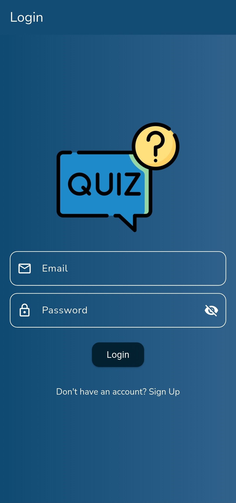
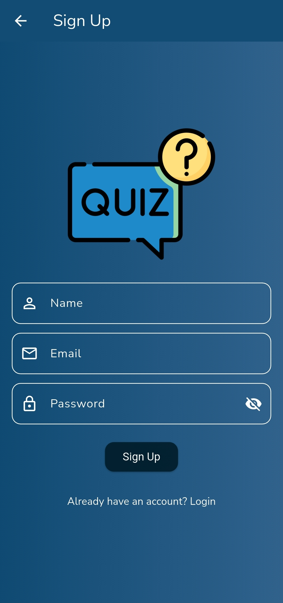
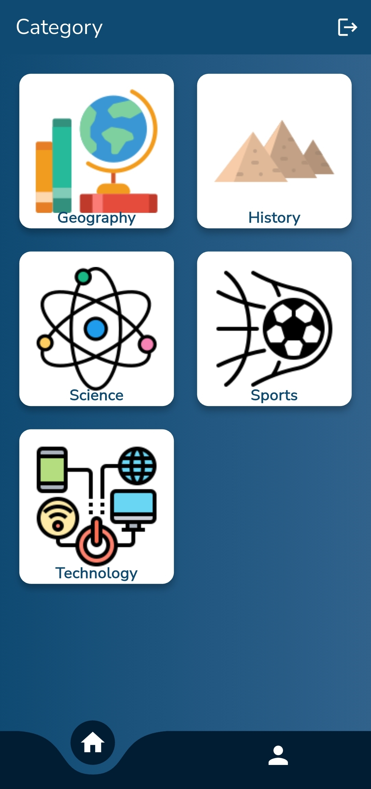
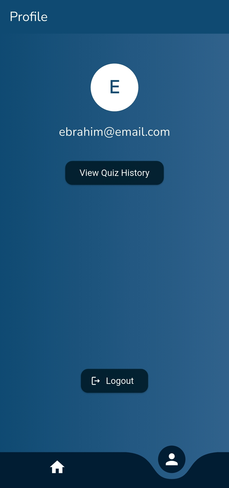

❓ Quiz App

A modern quiz application built with Flutter, Firebase, and Riverpod.
This app allows users to sign up, take quizzes across multiple categories, track their results, and view history with a polished UI.

🚀 Features

- User Authentication (Email & Password with Firebase Auth)
- Browse Categories (with images)
- Take Quizzes (with timer, shuffled answers, and scoring)
- Result Screen (with score, percentage, retry & back options)
- Quiz History (Firestore-based, sorted by date)
- Firestore Security Rules applied for safe data access
- Clean Folder Structure with Repositories + Providers (Riverpod)
- Modern UI with animations & polished result screen

📂 Folder Structure
lib/
 ├── main.dart
 ├── models/         # Data models (User, Category, Question, History)
 ├── repositories/   # Firebase communication (Auth, Quiz, History)
 ├── providers/      # Riverpod state management
 ├── screens/        # UI Screens (Login, Category, Quiz, Result, Profile, History)
 └── theme/          # App-wide theme & background styles

🛠️ Tech Stack

- Flutter (UI)
- Dart (logic)
- Firebase Authentication (email & password login)
- Cloud Firestore (categories, questions, quiz history)
- Riverpod (state management)

📸 Screenshots

  <h3>Login Screen</h3>

  <h3>SignUp Screen</h3>

  <h3>Home Screen</h3>

  <h3>Quiz Screen</h3>

  <h3>Profile Screen</h3>

<h3>History Screen</h3>

🔒 Firestore Security Rules (Simplified)
match /users/{userId} {
  allow read, create, update: if request.auth.uid == userId;
}

match /categories/{categoryId} {
  allow read: if true;
}

match /questions/{questionId} {
  allow read: if true;
}

match /quiz_results/{resultId} {
  allow read, create: if request.auth.uid == resource.data.userId;
}

▶️ Getting Started

1.Clone the repo
git clone https://github.com/ebroahmed/quiz_app.git
cd flutter-quiz-app

2️. Install dependencies
flutter pub get

3️. Configure Firebase

Create a Firebase project

Enable Authentication (Email/Password)

Enable Firestore Database

Add your google-services.json (Android) and GoogleService-Info.plist (iOS)

4️⃣ Run the app
flutter run

👨‍💻 Author

Developed by Ebrahim Ahmed

📧 [ebrahimahmed804853@gmail.com]

💼 [Github (https://github.com/ebroahmed/)] 
